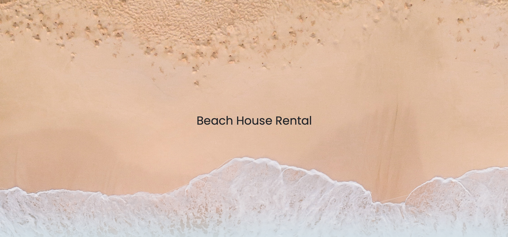
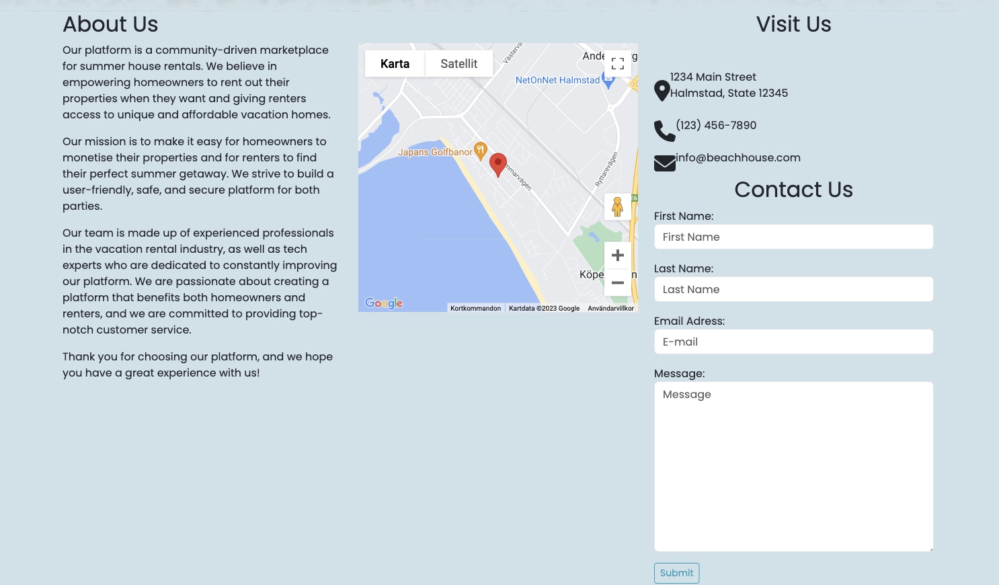
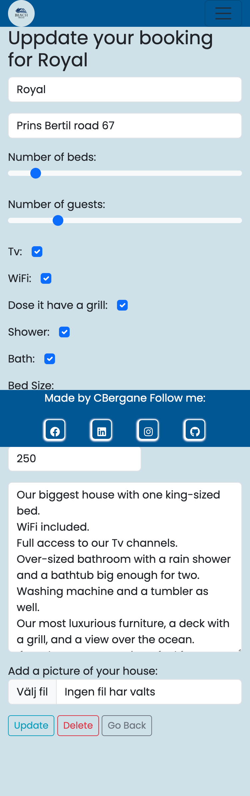

# Beach House!


Beach House is a mock site for a community that wishes to rent out its summer houses to guests.
The main focus of the site is an easy way for the guests to get an overview of what kind of properties there is to rent, the guest can filter from a list of options to get a more specific house to rent.

If the user is a house owner who wishes to rent out their house, they can fill out an application for the house to the site owner who will get a preview of the house and can then choose to display it.

Visit the deployed site [here](https://airbnbbeachhouse.herokuapp.com/index).

## Table of Contents

1. [User Experience (UX)](#user-experience-ux)
    1. [Strategy](#strategy)
        1. [Project Goals](#project-goals)
        2. [User Goals](#user-goals)
        3. [Strategy Table](#strategy-table)
    2. [Scope](#scope)
        1. [User Stories](#user-stories)
    3. [Structure](#structure)
    4. [Skeleton](#skeleton)
    5. [Surface](#surface)
2. [Features](#features)
    1. [General](#general)
    2. [Home Page](#home-page)
    3. [Profile](#profile)
    4. [Our Houses](#our-houses)
    5. [Admin](#admin)
3. [Technologies Used](#technologies-used)
    1. [Languages Used](#languages-used)
    2. [Libraries and Frameworks](#languages-and-frameworks)
    3. [Packages / Dependencies Installed](#packages--dependencies-installed)
    4. [Database Management](#database-management)
    5. [Tools and Programs](#tools-and-programs)
4. [Testing](#testing)
    1. [Go to TESTING.md](https://github.com/josswe26/code-buddy/blob/main/TESTING.md#code-buddy-testing)
5. [Deployment](#deployment)
6. [Finished Product](#finished-product)
7. [Credits](#credits)
8. [Known Bugs](#known-bugs)
9. [Acknowledgements](#acknowledgements)


***

## User Experience (UX)

### Strategy

#### Project Goals

* The website contains simple colours for a modern design and also not to draw attention from the content.
[add a pic of colours for the site here]

* Responsive design to make the website accessible on different screen sizes.

* Structure is easy to understand and navigates effortlessly.

* Site users can register an account to interact with the content.

* The users can both book and add a house for rent.

* The site admin can sort between the houses and choose which to display.


#### User Goals

* As a Site Admin, I want to manage the site content.

* As a Site User, I want to be able to interact with the content.

* As a Site User, I want the information to be easy to find and read.

* As a Site User, I can do a booking or add a house for rent.

* As a Site User, I want to manage the content I created.


#### Strategy Table

Strategy | Description |
--- | --- | 
User signups | Make it easy for users to signup to the page. |
An easy way for users to display their houses for new customers | Offer better tools for property owners to list and showcase their properties, encourage more detailed and attractive listings. |
Enhance guest experience | Streamline the booking and check-in process. |
Have a responsive design | Make the content responsive on smaller devices. |


### Scope

Since this is a mock site, there is no actual booking of real houses, but the goal is that I should be able to use it in real life as close to ready to go.
The purpose of this site is for a community to have a portal for their houses to be rented out for a set price.
Some of the functions:

* Responsive design.
* A easy way to sign up.
* List houses that the site admin has approved for display.
* An easy way for the site admin to see what's going on and control it.
* An easy way for the owners of the houses to list their house/houses.

#### User Stories

GitHub projects was used as my project management tool to track user stories.

**Start Of The Project**


**Week 1**


**Week 2**


**Week 3**


**Week 4**


### Structure

The website has been organised in a Hierarchical Tree Structure to ensure the site user navigates through the site effortlessly and intuitively. Here you can find the website map design.


**Contact Model**

* fname: A first name must be added to the message.
* lname: A last name must be added to the contact form.
* email: An email address to let the staff get in contact with whom ever sent the message.
* message: A message with a max length of 300 and cant be left blank.

**House Model**

* name: Gives the house a name.
* address: Gives an address to the house so the booker can locate it.
* owner: A owner for the house and it can't be left blank.
* beds: Number of beds that the house contains.
* capacity: the number of guests that the house will hold.
* price: Give a price per night.
* description: The owner describes the house, but it can be left blank.
* house_image: A picture of the house but there is a default img given by the site if none is given.
* has_tv: If the house has a tv in the inventory.
* has_wifi: If the house has wifi in the inventory.
* has_bbq: If the house has a bbq in the inventory.
* has_shower: If the house has a shower in the inventory.
* has_bath: If the house has a bath in the inventory.
* BED_SIZE_CHOICES: the different choices of bed sizes to choose from.
* bed_size: the choice made by the owner to be displayed for the user.
* approved: an approved option from the staff/admin to be displayed, set to false so it can be inspected first.

**Booking Model**

* user: Set to whom is logged in as a foreign-key and all bookings made with this user will be deleted if the user is deleted.
* house: Also set to foreign-key and bound to the house, if the house is deleted the bookings on the house will be deleted with it.
* checkin: The check-in date for the house.
* checkout: The checkout date for the house.


### Skeleton

#### Wireframes

[Balsamiq](https://balsamiq.com/) has been used to showcase the appearance of the site and display the placement of the different elements whitin the pages.

Page | Desktop Version/Tablet Version/ Mobile Version
--- | ---
Index | 
House list | 
Booking | 
Profile | 
Admin | 

### Surface

#### Color Scheme

The colours were chosen keeping in mind simplicity but also providing the website with a modern design. This is to keep the focus on the content but also appeal to the users.


The colour #CEE1E8 was chosen for the background to be easy on the eyes and make the text readable.
#0D9FBE is used on the main buttons. #E75A0D is used to highlight the hover effects in the menu. #005794 is used on the navbar and the footer.

#### Typography

The main font being used in the site is Poppins, with sans-serif as a fallback in case Poppins doesn't get imported correctly. 

[Back to top ⇧](#beach-house)

## Features

### General

* The website has been designed from a mobile first perspective.

* Responsive design across all device sizes.

* Navigation Bar
    * The navbar contains the logo and section links for the site.
    * The navbar has a hover effect that highlights what items you are about too click.


* Footer
    * The footer contains social media links to the creator's content.
    * The items has a hover effect of making it more interesting and open the social media in a separate tab.


### Home Page

* The main landing page.
    * The main landing hero image is a parallax image with a scroll effect controlled by both CSS and javascript.



* Main content on the index.
    * The main content on index.html is a short about us, a map location to find their office and a contact form.



### Profile

* The profile page contains both the bookings made by the user and if they have any houses put up for rent.
    * The user can update both the booking and the house content.


### Our Houses

* Our houses contain a list of houses that the staff/site admin has approved.

    * The list will fade as you scroll down the page.
    * There is a way to filter the list of houses.
    * A link to book a specific house is on the bottom of the card.


### Admin
* The admin page contains a calendar, a list of all the bookings for all houses. A list of houses to approve and a Link to get a preview of the card with an inventory list and a list of messages sent from index.html.

    * The calendar change house bookings to have an overlook.
    * The booking list contains a checkout function that activates if the checkout day is that day or in the past. You can also click between months.
    * The approving list contains a button to get you to the preview page.
    * The messages have a counter and can be deleted as you are done with them.


### Authentication Pages

* The Authentication Pages is handled with django allauth.
    * The logout function is manage with a modal.


[Back to top ⇧](#beach-house)

## Technologies Used

### Languages Used

* [HTML5](https://en.wikipedia.org/wiki/HTML)
* [CSS3](https://en.wikipedia.org/wiki/CSS)
* [JavaScript](https://en.wikipedia.org/wiki/JavaScript)
* [Python](https://en.wikipedia.org/wiki/Python_(programming_language))

### Libraries and Frameworks

* [Django](https://www.djangoproject.com/)   
    * Django was used as web framework.

* [Django Template](https://jinja.palletsprojects.com)  
    * Django Template was used as a templating language for Django to display backend data to HTML.
   
* [Bootstrap 5](https://getbootstrap.com/docs/5.0/getting-started/introduction/)  
    * Bootstrap 5 was used throughout the website to help with styling and responsiveness.

* [Google Fonts](https://fonts.google.com)  
    * Google fonts were used to import the fonts into the html file and were used on all parts of the site.

* [Font Awesome](https://fontawesome.com)  
    * Font Awesome was used throughout the website to add icons for aesthetic and UX purposes. 


### Packages / Dependencies Installed

* [Django Allauth](https://django-allauth.readthedocs.io/en/latest/)  
    * Django Allauth was used for user authentication, registration, and account management.

* [Gunicorn](https://gunicorn.org/)  
    * Gunicorn was used as Python WSGI HTTP Server for UNIX to support the deployment of Django application.

* [Cloudinary](https://cloudinary.com/)
    * Cloudinary has been used as image management solution

### Database Management
* [ElephantSQL Postgres](https://www.elephantsql.com)   
    * ElephantSQL database was used in production, as a service based on PostgreSQL provided by ElephantSQL.

### Tools and Programs

* [Git](https://git-scm.com)  
    * Git was used for version control by utilising the Gitpod terminal to commit to Git and Push to GitHub. 

* [GitPod](https://gitpod.io/)
     * GitPod was used for writing code, committing, and then pushing to GitHub.

* [GitHub](https://github.com)  
   GitHub was used to store the project's code after being pushed from Git. 

* [Heroku](https://www.heroku.com)   
    * Heroku was used to deploy the website.

* [Elephantsql](https://www.elephantsql.com)
    * Elephantsql was used to help host the Postgres database with Heroku.

* [Am I Responsive](ami.responsivedesign.is)  
    * Am I Responsive was used to preview the website across a variety of popular devices.

* [Balsamiq](https://balsamiq.com/)
     * Balsamiq was used to create the wireframes during the design phase of the project

* [Chrome DevTools](https://developer.chrome.com/docs/devtools/)
    * Chrome DevTools was used during development process for code review and to test responsiveness.

* [W3C Markup Validator](https://validator.w3.org/)
    * W3C Markup Validator was used to validate the HTML code.

* [W3C CSS Validator](https://jigsaw.w3.org/css-validator/)
    * W3C CSS Validator was used to validate the CSS code.

* [JSHint](https://jshint.com/) 
    * The JSHints JavaScript Code Quality Tool was used to validate the site's JavaScript code.

* [Figma](https://www.figma.com)
    * Figa was used to make the sitemap.

[Back to top ⇧](#beach-house)

## Testing

The testing documentation can be found [here](https://github.com/CBergane/beachhouse/blob/main/TESTING.md#beach-house-testing).

[Back to top ⇧](#beach-house)

## Deployment

This project was developed using a [GitPod](https://gitpod.io/) workspace. The code was committed to [Git](https://git-scm.com/) and pushed to [GitHub](https://github.com/") using the terminal.

### Deploying on Heroku
To deploy this page to Heroku from its GitHub repository, the following steps were taken:

1. Create the Heroku App:
    * Select "Create new app" in Heroku.
    * Choose a name for your app and select the location.

2. Attach the Postgres database:
    * In the Resources tab, under add-ons, type in Postgres and select the Heroku Postgres option.

3. Prepare the environment and settings.py file:
    * In the Settings tab, click on Reveal Config Vars and copy the url next to DATABASE_URL.
    * In your GitPod workspace, create an env.py file in the main directory. 
    * Add the DATABASE_URL value and your chosen SECRET_KEY value to the env.py file.
    * Add the SECRET_KEY value to the Config Vars in Heroku.
    * Update the settings.py file to import the env file and add the SECRETKEY and DATABASE_URL file paths.
    * Update the Config Vars with the Cloudinary url, adding into the settings.py file also.
    * In settings.py add the following sections:
        * Cloudinary to the INSTALLED_APPS list
        * STATICFILE_STORAGE
        * STATICFILES_DIRS
        * STATIC_ROOT
        * MEDIA_URL
        * DEFAULT_FILE_STORAGE
        * TEMPLATES_DIR
        * Update DIRS in TEMPLATES with TEMPLATES_DIR
        * Update ALLOWED_HOSTS with ['app_name.heroku.com', 'localhost']

4. Store Static and Media files in Cloudinary and Deploy to Heroku:
    * Create three directories in the main directory; media, storage and templates.
    * Create a file named "Procfile" in the main directory and add the following:
        * web: gunicorn project-name.wsgi
    * Go to the Deploy tab on Heroku and connect to GitHub, then to the required repository.
    Click on the Deploy Branch and wait for the build to load. When the build is complete, the app can be opened through Heroku.

[Back to top ⇧](#beach-house)

### Forking the Repository
By forking the GitHub Repository we make a copy of the original repository on our GitHub account to view and/or make changes without affecting the original repository by using the following steps...

1. Log into [GitHub](https://github.com/login) or [create an account](https://github.com/join).
2. Locate the [GitHub Repository](https://github.com/josswe26/code-buddy).
3. At the top of the repository, on the right side of the page, select "Fork"
4. You should now have a copy of the original repository in your GitHub account.

### Creating a Clone
How to run this project locally:
1. Install the [GitPod Browser](https://www.gitpod.io/docs/browser-extension/ "Link to Gitpod Browser extension download") Extension for Chrome.
2. After installation, restart the browser.
3. Log into [GitHub](https://github.com/login "Link to GitHub login page") or [create an account](https://github.com/join "Link to GitHub create account page").
2. Locate the [GitHub Repository](https://github.com/josswe26/code-buddy).
5. Click the green "GitPod" button in the top right corner of the repository.
This will trigger a new gitPod workspace to be created from the code in GitHub where you can work locally.

How to run this project within a local IDE, such as VSCode:

1. Log into [GitHub](https://github.com/login) or [create an account](https://github.com/join).
2. Locate the [GitHub Repository](https://github.com/CBergane/beachhouse).
3. Under the repository name, click "Clone or download".
4. In the Clone with HTTPs section, copy the clone URL for the repository.
5. In your local IDE open the terminal.
6. Change the current working directory to the location where you want the cloned directory to be made.
7. Type 'git clone', and then paste the URL you copied in Step 3.
```
git clone https://github.com/CBergane/beachhouse
```
8. Press Enter. Your local clone will be created.

Further reading and troubleshooting on cloning a repository from GitHub [here](https://docs.github.com/en/free-pro-team@latest/github/creating-cloning-and-archiving-repositories/cloning-a-repository)

[Back to top ⇧](#beach-house)

## Finished Product

Page | Desktop | Tablet | Mobile |
--- | --- | --- | --- |
| Home |  |  |  |
| Signup |  |  |  |
| Login |  |  |  |
| Profile | |  |  |
| Booking Update | |  |  |
| House Update | |  |  |
| Our Houses | |  |  |
| Admin | |  |  |
| House Preview |  |  |  |
| 404 Error | |  |  |


[Back to top ⇧](#beach-house)

## Credits

### Content

* Website content was written by the developer.
* Inspiration was taken from [Youtube](https://www.youtube.com/@Codemycom)

### Media

* [Unsplash](https://unsplash.com/)
    * The houses where taken from unspash.
        * [Serjan Midili](https://unsplash.com/@s_midili)
        * [Deric](https://unsplash.com/@dericsamps)
        * [Zoltan Tasi](https://unsplash.com/@zoltantasi)
        * [Ostap Senyuk](https://unsplash.com/@kintecus)

    * The Hero image where taken from unspach.
        * [Ethan Dow](https://unsplash.com/@ethandow)
    
    * The favicon and logo was made with [Canva](https://www.canva.com)

[Back to top ⇧](#beach-house)

### Code

* [Stack Overflow](https://stackoverflow.com/) and [W3Schools](https://www.w3schools.com/) were consulted regularly for inspiration and sometimes to be able to better understand the code being implemented.

* Message implementation and dismissal code are taken from [Code Institute](https://codeinstitute.net/)'s django-blog project.

[Back to top ⇧](#beach-house)

## Known Bugs

* The javascript gives a warning in Chrome developer tools when there is no "go back" button.
* It also gives warnings on the date picker but doesn't seams to affect any functions, so I have decided to ignore them.

[Back to top ⇧](#beach-house)

## Acknowledgements

* To my family, who has been a fantastic support.
* My mentor, Marcel, for constantly pushing me to do more.
* My amazing Slack community for giving good feedback and help.
* Code institute tutors who have helped me with some minor code. Sadly can't remember their names of them.

[Back to top ⇧](#beach-house)